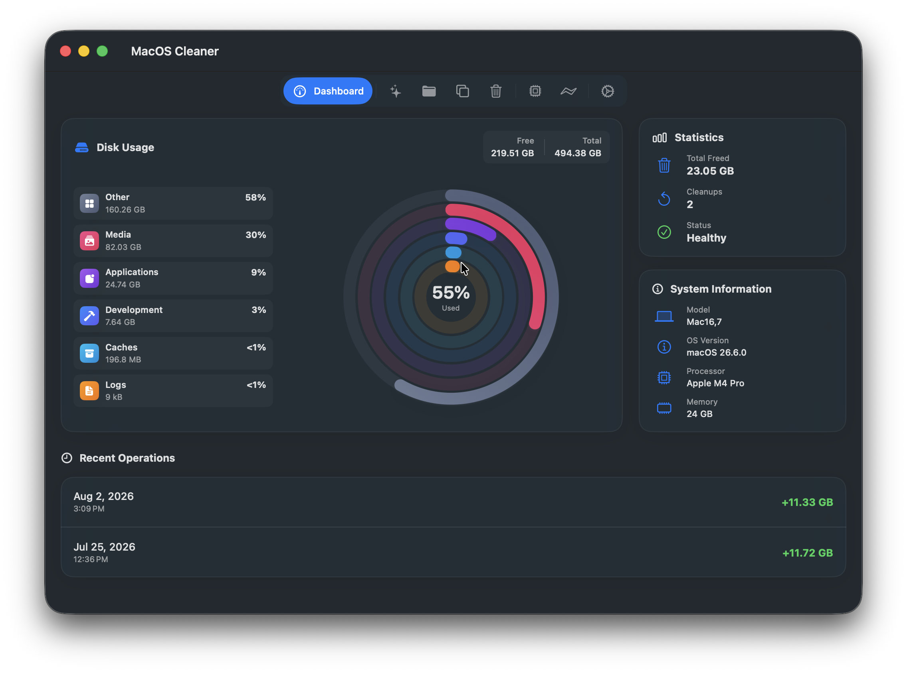
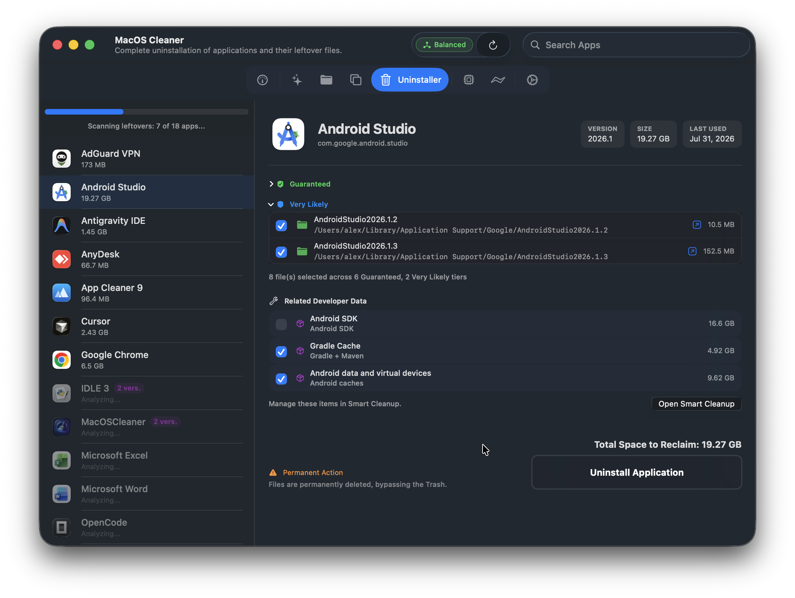
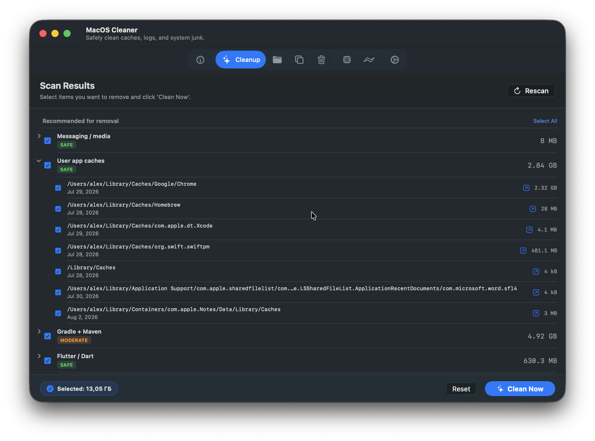
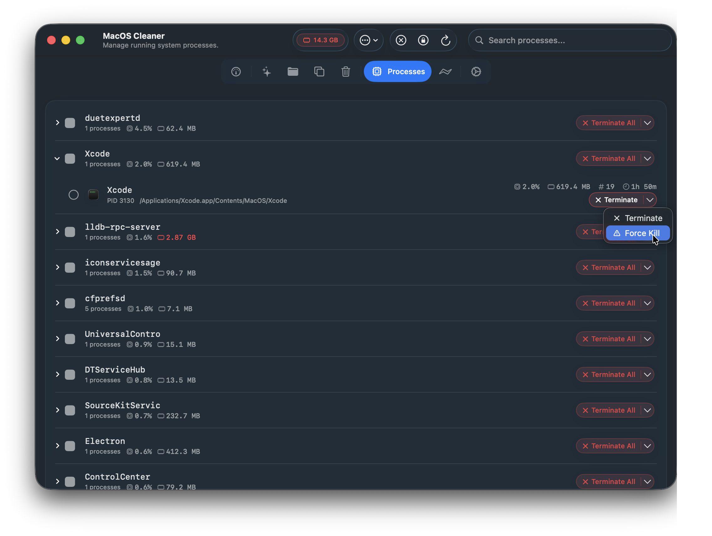

<h1 align="center">
   <span style="font-size:2em; font-weight:bold">MacOS Cleaner</span>
</h1>

<span align="center">

[](LICENSE)
[](https://github.com/AlexTkDev/MacOSCleaner/stargazers)
[](https://apple.com)
[](https://swift.org)
[](https://developer.apple.com/documentation/swiftui/)
[](https://github.com/yonaskolb/XcodeGen)
[]()
[](https://ko-fi.com/alextkdev)

</span>

🧹 Free up disk space by cleaning caches, temp files, app leftovers, duplicates, and more. Review candidates first, confirm what to remove, automate safe cleanups with Siri or Shortcuts, and recover from Trash when you need to.

---

## Screenshots

<p align="center">
  
  
</p>
<p align="center">
  
  
</p>

<p align="center">
  <a href="assets/screenshots">📷 View all screenshots</a>
</p>

---

## 🚀 Quick Install & Download

### GitHub Releases (DMG)
Download the latest signed release directly from **[GitHub Releases](https://github.com/AlexTkDev/MacOSCleaner/releases/latest)**.

---

## Features

🧠 **Apple Intelligence** — Native local AI explanations powered by `FoundationModels` (requires macOS 26.0+). Operates fully offline on supported Apple Silicon Macs. Explains files, caches, running processes, and startup agents to help you decide what is safe to remove. Prompts are optimized in English for higher model reasoning, with explanations output in your preferred UI language (English, Русский, Українська, Español). Fully toggleable in settings, with real-time model status tracking.

🌍 **Fully Localized** — English, Deutsch, 日本語, Français, 简体中文, Italiano, Português (Brasil), Español, Русский, Українська (10 languages with 100% key parity). All UI, errors, logs, and system info translated dynamically. Dates and byte counts format automatically for your language.

🎙️ **Siri, Shortcuts & Automator** — native App Intents can clean developer caches, clean a specific category, report storage and Trash status, or run a scheduled cleanup. App Shortcuts support voice commands through Siri. Automation integrations can be enabled individually and managed from Settings.

**Dashboard** 📊 — native Liquid Glass design for macOS 27 with interactive Apple Watch-style activity rings. Shows total and available disk capacity, storage categories, system info (model, CPU, RAM, macOS version), cleanup history and stats.

**Smart Cleanup** 🔍 — scans 54 categories using 1,770 path definitions covering 251 apps and 66 CLI toolchains:

- **Caches & Containers** — Browsers (Safari, Chrome, Firefox, Arc, etc.), Messengers, App Containers, System & WebKit caches, dynamic Electron discovery.
- **Dev Tools & IDEs** — Xcode DerivedData and Simulators, Android SDK/Studio, package managers (Homebrew, npm, Cargo, Go, SwiftPM), JetBrains, VS Code, Cursor, Docker, and local project build artifacts.
- **System & Maintenance** — APFS purgeable space, local Time Machine snapshots, Mail attachments, logs, crash reports, QuickLook thumbnails, Font and DNS cache flushing, LaunchAgents/Daemons.
- **Leftovers & Junk** — evidence-backed orphaned app remnants, `.DS_Store`, `__MACOSX`, broken symlinks, old installers (DMG/PKG/ISO), large files, old backups, duplicates, and unused apps (180+ days).
- **Local AI Models** — detects Ollama, Hugging Face, LM Studio, Jan, MLX, PyTorch, Whisper, vLLM, and Draw Things data for opt-in review.

Cleanup tasks run in parallel across all available cores for maximum speed. All categories are scanned, while risky or personal-content groups remain unselected for review. Dev-related ones show a purple "DEV" badge. Risk badges (Safe / Moderate / Dangerous / Protected) appear after scan — you pick what to delete, then confirm.

**Cleanup Options** — toggles before scan:
- **Clean .DS_Store files** — removes Finder metadata from directories (off by default)
- **Clean Maven repository** — removes Maven cached dependencies from `~/.m2/repository` (off by default)
- **Clean Go module cache** — removes Go package caches from `GOMODCACHE` (off by default)
- **Clean .dart_tool in projects** — scans and cleans Flutter/Dart development builds in common project locations (off by default)
- **Clean iCloud Documents** — includes iCloud document cache (off by default)
- **Clean Voice Memos** — includes Voice Memos recordings (off by default)
- **Clean GarageBand / Logic** — includes project files and caches (off by default)
- **Clean iMovie / Final Cut** — includes render files and libraries (off by default)
- **Clean Sleep Image** — removes hibernation image file (off by default)

**Project Build Artifacts** 🛠️ — safely detects regenerable output in common project folders. Supports Xcode/Swift, Android/Gradle, Flutter/Dart, Node.js, Rust, Go, Python, and CMake. Ambiguous directories such as `build`, `dist`, `target`, `vendor`, `venv`, and `node_modules` are included only when matching project files are present.

**Duplicate File Finder** 🧬 — finds exact duplicates without external dependencies using a staged pipeline: file size → first 4 KB hash → full SHA-256. Scanning uses Swift actors for race-free parallelism, and smart selection keeps the most appropriate copy by default.

**Disk Space Analyzer** 📁 — scan any custom folder to browse its subdirectories and files sorted by size. Features categorized breakdowns (Videos, Audio, Photos, Apps, Documents, Archives) and lets you reveal items in Finder or move them to the Trash directly from the app.

**Process Manager** ⚙️ — lists running processes in Flat or Grouped views and sorts by CPU, memory, name, or threads. A native Liquid Glass split button terminates with one click or exposes force quit when needed. Supports individual processes, multiple selection, or entire groups. Critical system processes (`kernel_task`, `launchd`, `WindowServer`) are protected automatically. Custom Whitelists and Blacklists prevent accidental termination or help close unwanted apps quickly.

**Startup Services** 🚀 — redesigned with modern macOS styling. Scans LaunchAgents and LaunchDaemons from both user-level (`~/Library`) and system-level (`/Library`) directories. Categorizes them automatically into My Services (User), Third-party, and System services. Allows you to load/unload or stop active services (asking for permissions via AppleScript when necessary), and configure custom vendor prefixes (System Vendors) to protect specific services from accidental modification.

**App Uninstaller** 🗑️ — drag and drop any `.app` bundle directly or select from the complete app list. Finds installed apps and previously orphaned remnants using a bounded filesystem index and 30 types of evidence (Bundle ID, Team ID, Spotlight, Plist contents, known catalog paths, and more). Shows total reclaimable space and real-time scan progress. Tailored rules cover Docker, Parallels, Adobe CC, Microsoft Office, Discord, Figma, JetBrains, browsers, and more.

- **Scan Modes (Safe / Balanced)** — choose between *Safe* mode (depth 3, exact matches only, no Spotlight, highest confidence files) and *Balanced* mode (depth 5, full deep scan including Spotlight and fuzzy matching) to tailor uninstallation aggressiveness
- **Background Deep Scanning** — apps are scanned thoroughly in the background; the UI updates in real time as each app's total size is finalized
- **Evidence-Based Forensics** — each candidate file is scored against 30 evidence types: identity, code signing, system integration, metadata, content analysis, graph relationships, and Launch Services registration
- **Confidence Tiers** — `.guaranteed` (critical evidence), `.veryLikely`, `.possible`, or `.ignore`
- **Developer Components** — detects and offers to clean Android SDK, Gradle/Maven, Xcode DerivedData, iOS Simulators, Flutter pub-cache, Docker containers, and Homebrew artifacts
- **Reveal in Finder** — quick action to show any related file or folder in Finder before deleting
- **Why this file?** — each related file includes an evidence breakdown with localized explanations. Tap any file to see exactly why it was associated with the app
- **Post-Uninstall Verification** — re-scan confirms cleanup completeness; snapshots stored for rollback

**Smart Updates** 🔄 — automatic, lightweight background check for new versions on startup directly via GitHub Releases. Get gently notified when a new update is ready, without background daemons, persistent tracking, or extra dependencies.

**Settings** — modular Liquid Glass interface organized into General, Cleanup, Automation, Processes, Advanced, and About. Manage Full Disk Access and notifications through direct System Settings links, configure Debug Mode (hiding/showing detailed execution logs), Siri and Automator integrations, Apple Intelligence, themes, languages, scan-on-startup, Trash behavior, custom System Vendors, and more.

---

## How It Works

Runs on Apple Silicon (M1–M5) with full parallelism — cleanup categories execute concurrently across all available cores. File scanning uses bounded, stack-based iteration with cancellation checks, inode deduplication, batching, and cached size calculations.

Cleanup and residual discovery use tokenized path templates, an O(1) bundle registry, and filesystem heuristics (Bundle ID, Team ID, entitlements, Spotlight, and related signals). Every path has a purpose: regenerable `cache`, uninstall-only `app_data`, non-automatic `shared`, or opt-in `user_content`. Scheduled cleanup is restricted to safe caches and logs. Orphan detection requires at least two independent ownership signals before suggesting a leftover.

---

## Privacy & Safety 🛡️

- **100% Private** — No telemetry, no analytics, no usage tracking, and no remote logging. All operations run fully offline on your device.
- **Minimal Networking** — The only network connection is a startup update check using the GitHub Releases API (can be disabled in Settings).
- Disk Space and App Uninstaller move files to Trash via `trashItem(at:)` — recoverable by default
- Smart Cleanup removes selected cache and temporary data after confirmation
- `SafetyManager` blocks access to `/System`, `/usr`, `/bin`, `~/.ssh`, and other critical paths
- Personal-content roots, shared vendor services, updater components, and Messages attachments are protected by fail-closed path validation
- Symlinks and resolved paths are validated again immediately before every destructive operation
- Scheduled cleanup is limited to safe cache and log categories; review-only results always start unselected
- `ProcessSafetyPolicy` protects system-critical processes from termination
- Permanent deletion and automatic Trash handling are opt-in; cleanup can empty only items moved to Trash during the current session
- Apps are closed before cleanup (graceful terminate → force-kill after 3s)
- Full Disk Access is requested at startup

---

## Tech Stack

- **Swift 6** — actors, `async/await`, structured task groups
- **SwiftUI** — `@Observable`, `NavigationSplitView`, Charts, Liquid Glass
- **System Frameworks** — AppIntents, FoundationModels, CryptoKit
- **Build** — XcodeGen, validated build-time path code generation, whole-module optimization, `-O` Swift flag
- **Logging** — OSLog with structured subsystems
- **Architecture** — feature-oriented folders, component-based cleanup

---

## Build from Source

**Requirements:** macOS 26.0+, Xcode 18+, [XcodeGen](https://github.com/yonaskolb/XcodeGen)

```bash
cd MacOSCleaner
xcodegen
open MacOSCleaner.xcodeproj
```

Use **⌘R** to run, **⌘U** to test, or **Product → Archive** to create a distributable app.

---

## Troubleshooting

**⚠️ Fix damaged app attributes** (if macOS asks you to move app to trash 🗑️):
```bash
sudo xattr -r -c /Applications/MacOSCleaner.app
```
> **Note:** This command removes extended security attributes (such as the Gatekeeper quarantine flag) set by macOS for unsigned or locally built applications. It is completely safe: it does not alter system files, grant persistent permissions, or modify the app's contents.

---

**Logs:** open `Console.app` → filter by subsystem `input.MacOSCleaner`.

---

## 🧑‍💻 Currently Working On

Track active development, upcoming releases, and share your ideas in **[Discussion #12](https://github.com/AlexTkDev/MacOSCleaner/discussions/12)**.

---

## Feedback & Contributions

Found a bug or have an idea? [Open an issue](https://github.com/AlexTkDev/MacOSCleaner/issues) — contributions are welcome.

For detailed documentation, user guides, and FAQs, visit the 📖 [MacOSCleaner Wiki](https://github.com/AlexTkDev/MacOSCleaner/wiki).

> *Note: All contributions are subject to the project's [Contributor License Agreement (CLA)](CLA.md) to maintain dual-licensing capabilities.*

---

## ⭐️ Support & Star the Project

If **MacOS Cleaner** helped you free up disk space or speed up your Mac, please consider **giving the repository a ⭐️ Star on GitHub**! It takes 5 seconds and helps more macOS users find the app.

<p align="center">
  <a href="https://github.com/AlexTkDev/MacOSCleaner/stargazers">
    
  </a>
</p>

---

## License

Dual-licensed under:
- **[GNU GPLv3 + Commons Clause v1.0](LICENSE)** (Custom Non-Commercial) for open-source use, personal study, and non-commercial distribution. Direct sale, re-licensing, or commercialization of the software/binaries is strictly prohibited.
- **Commercial License** for proprietary, enterprise, or commercial distribution. [Contact the author](https://github.com/AlexTkDev) for commercial licensing inquiries.

> **Trademark & Branding Notice**: This license does not grant permission to use the project name ("MacOSCleaner"), logos, app icons, or branding in derivative works or redistributions. Modified versions or redistributions must remove or replace all official project branding.
