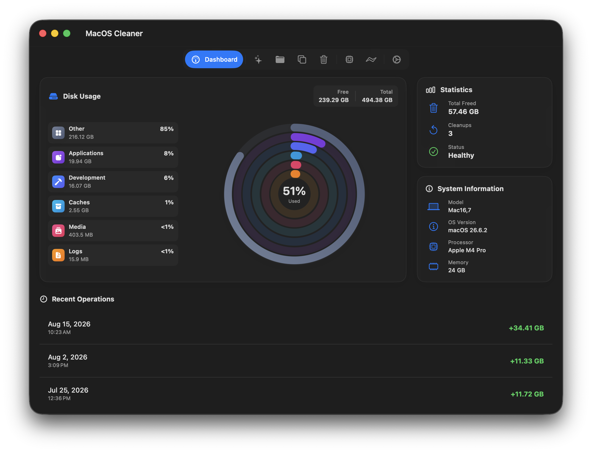
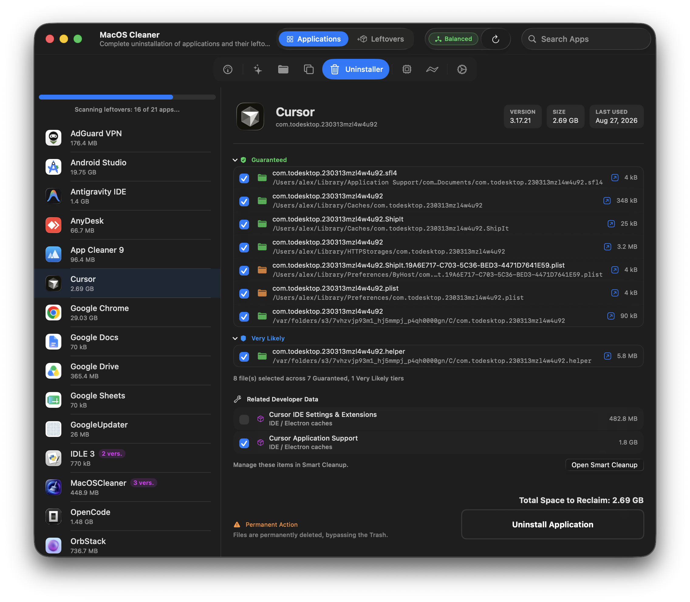
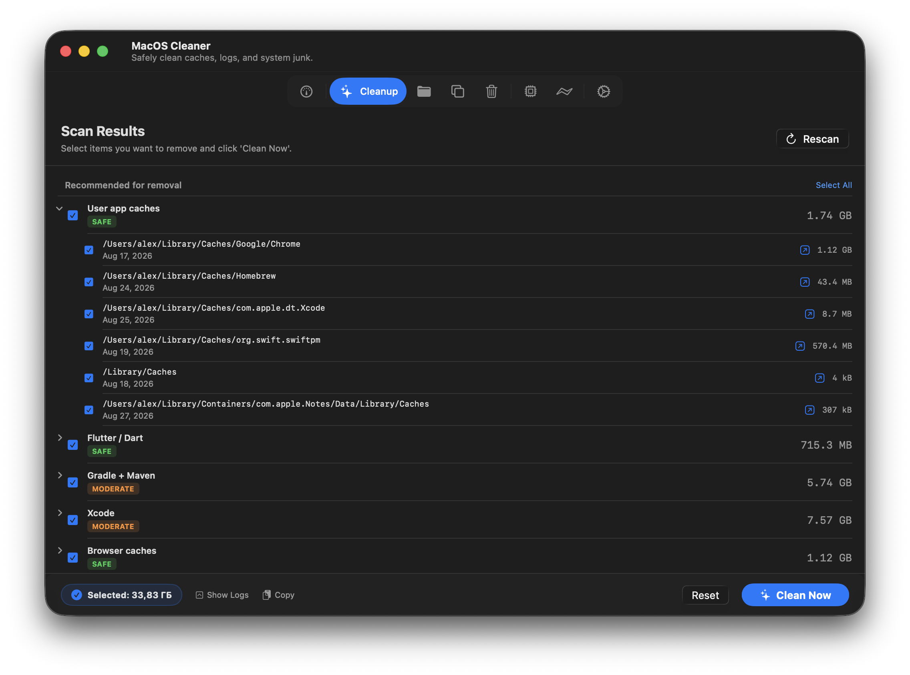
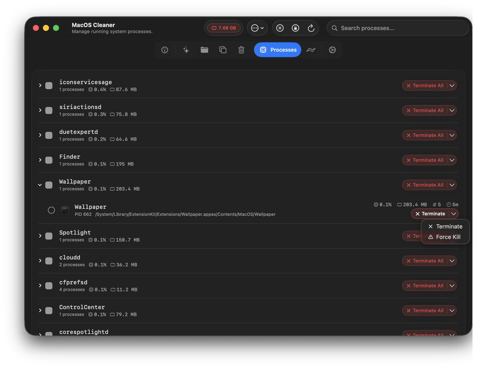

<div align="center">
  <h1 align="center">
    <br>
    <b style="font-size: 2rem">MacOS Cleaner</b>
  </h1>
  <p>
    Free, native, privacy-first cleaner and application uninstaller for macOS.<br>
    Built with Swift 6 and SwiftUI. Moves files to Trash by default instead of permanently deleting them.
  </p>

  <p>
    <small>Requirements: macOS 26.0 or later. Apple Silicon only (Intel Macs are not supported).</small>
  </p>

  <p>
    <a href="https://github.com/AlexTkDev/MacOSCleaner/releases/latest"></a>
    &nbsp;
    <a href="https://alextkdev.github.io/MacOSCleaner/"></a>
  </p>

  <p>
    <a href="https://github.com/AlexTkDev/MacOSCleaner/releases/tag/2.2.0"></a>
    <a href="https://apple.com"></a>
    <a href="https://swift.org"></a>
    <a href="https://developer.apple.com/xcode/swiftui/"></a>
    <a href="LICENSE"></a>
  </p>

  <p>
    <a href="#features">✨ Features</a> &nbsp;•&nbsp;
    <a href="#screenshots">📸 Screenshots</a> &nbsp;•&nbsp;
    <a href="#build-from-source">🛠️ Build from Source</a> &nbsp;•&nbsp;
    <a href="https://github.com/AlexTkDev/MacOSCleaner/wiki">📖 Documentation</a>
  </p>
</div>

---

<a id="safety"></a>
## 🛡️ Safety and Architecture

| Principle | Technical Implementation |
| :--- | :--- |
| **No Telemetry** | No background daemons, analytics SDKs, or remote loggers. All scanning runs locally without network access. |
| **Trash-First** | Files are moved to macOS Trash via `trashItem(at:)` when supported, preserving native file recovery. |
| **Protected Paths** | Hardcoded blocklists protect SIP paths, `/System`, `/Library`, `/usr`, `~/.ssh`, and user document directories. |
| **Open Core** | Swift 6 codebase with strict concurrency, actors, and structured task groups. Core engine and heuristics are inspectable. |
| **On-Device AI** | Checksums, hashes, and `FoundationModels` file explanations execute strictly on-device. |
| **Native Runtime** | Built in Swift 6 and SwiftUI with Liquid Glass materials. No Electron or WebKit container overhead. |

---

<a id="screenshots"></a>
## 📸 Screenshots

<p align="center">
  
  
</p>
<p align="center">
  
  
</p>

<p align="center">
  <a href="assets/screenshots">View high-resolution screenshots</a>
</p>

---

## 🚀 Quick Download & Install

1. **Direct Download:** Grab the latest `.dmg` from [GitHub Releases](https://github.com/AlexTkDev/MacOSCleaner/releases/latest).
2. **Mount & Drag:** Open the `.dmg` and drag `MacOSCleaner.app` into `/Applications`.
3. **First Launch (Gatekeeper):** If macOS shows a Gatekeeper warning on locally built/unnotarized apps:
   ```bash
   sudo xattr -r -c /Applications/MacOSCleaner.app
   ```
   > *Note: This removes the quarantine attribute set by macOS. It does not modify app files, system security, or grant persistent permissions.*

---

<a id="features"></a>
## ✨ Features

- **Smart Cleanup:** scans 55+ categories across system caches, 275+ applications, 85+ developer toolchains & package managers (Xcode, Docker, `uv`, `mise`, Rust, Go, Python, Node), local AI models & coding assistants (Claude Code, Ollama, MLX, Hugging Face, WhisperKit), and safe Time Machine snapshot thinning (`thinlocalsnapshots`).
- **Forensic Uninstaller:** inspects 30 evidence types (Bundle ID, Team ID, Spotlight metadata, Launch Services) to trace remnants across 1,800+ known application paths and heuristics, with standalone orphaned residuals discovery, confidence score tiers, post-uninstall review sheets, and root-level helper removal.
- **Duplicate Finder:** identifies duplicate files through a 3-stage pipeline (file size matching, 4 KB header checksum, full SHA-256 verification).
- **Disk Space Analyzer:** hierarchical folder drill-down with breadcrumb navigation, honest APFS allocated block sizing (`totalFileAllocatedSize`), Quick Look previews (`Space`), recursive category filters (Videos, Audio, Photos, Documents, Archives), and dataless iCloud item skip protection.
- **Process and Service Manager:** monitors live CPU and RAM usage with termination safeguards for critical processes (`kernel_task`, `launchd`), plus LaunchAgents and LaunchDaemons toggling.
- **Native System Integrations:** on-device `FoundationModels` explanations for unknown caches, Siri and App Intents automation, Liquid Glass materials with keyboard navigation (`⌘,`, `⌘C`, `⌘F`, `⌘R`, `⌘⌫`), and 10 language localizations.

Complete feature breakdowns and path specifications are documented in the [MacOSCleaner Wiki](https://github.com/AlexTkDev/MacOSCleaner/wiki).

---

<a id="build-from-source"></a>
## 🛠️ Build from Source

**Prerequisites:** macOS 26.0+, Xcode 18+, [XcodeGen](https://github.com/yonaskolb/XcodeGen).

```bash
git clone https://github.com/AlexTkDev/MacOSCleaner.git
cd MacOSCleaner/MacOSCleaner
xcodegen
open MacOSCleaner.xcodeproj
```

Build and run with **⌘R**, or run tests with **⌘U**.

> *Note: Public source builds use the public fallback cleanup catalog.*

---

<a id="community"></a>
## ⭐️ Support & Community

If you find MacOS Cleaner useful, please consider giving it a ⭐️ on GitHub. It helps more users discover the project and directly supports ongoing development.

- <a href="https://github.com/AlexTkDev/MacOSCleaner/stargazers"></a> — [Star the repository](https://github.com/AlexTkDev/MacOSCleaner/stargazers) and watch releases for update notifications.
- <a href="https://github.com/AlexTkDev/MacOSCleaner/discussions"></a> — [Ask questions, propose features, and share feedback.](https://github.com/AlexTkDev/MacOSCleaner/discussions)
- <a href="https://github.com/AlexTkDev/MacOSCleaner/issues"></a> — [Report bugs or suggest rule improvements.](https://github.com/AlexTkDev/MacOSCleaner/issues)
- <a href="https://github.com/AlexTkDev/MacOSCleaner/wiki"></a> — [Architecture overview and developer guides.](https://github.com/AlexTkDev/MacOSCleaner/wiki)
- <a href="https://cursor.com/codebase/alextkdev/MacOSCleaner/tree/release"></a> — [Explore repository online and open in Cursor.](https://cursor.com/codebase/alextkdev/MacOSCleaner/tree/release)

> *Note: Contributions are subject to the project's [Contributor License Agreement (CLA)](CLA.md).*

---

## 👨‍💻 Author

<table>
  <tr>
    <td width="72" align="center" valign="middle">
      <a href="https://github.com/AlexTkDev">
        
      </a>
    </td>
    <td>
      <strong>Aleksandr (AlexTkDev)</strong><br>
      <a href="https://github.com/AlexTkDev"></a>
      <a href="https://orcid.org/0009-0002-8907-5406"></a>
      <a href="https://ko-fi.com/alextkdev"></a>
      <a href="DONATE.md"></a>
    </td>
  </tr>
</table>

> Citation reference: [`CITATION.cff`](CITATION.cff)

---

## 📄 License

Dual-licensed:
- **[GNU GPLv3 + Commons Clause v1.0](LICENSE)** for personal, non-commercial use, testing, and open-source contributions. Commercial resale and commercial re-licensing are prohibited.
- **Commercial License** for enterprise, commercial, or proprietary distribution. [Contact the author](https://github.com/AlexTkDev) for licensing inquiries.

> **Trademark Notice**: The license does not grant permission to use the project name ("MacOSCleaner"), logos, or branding in derivative works.
