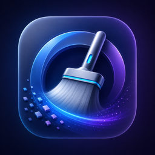
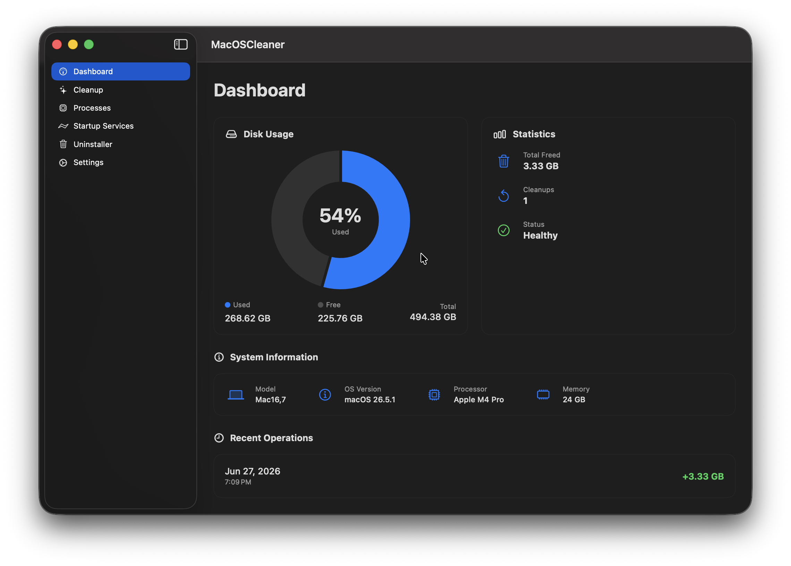
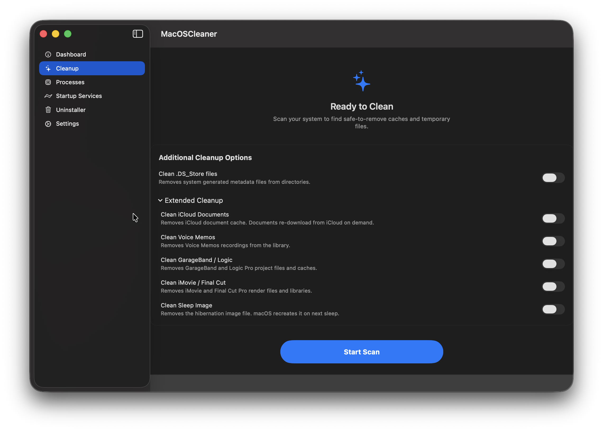
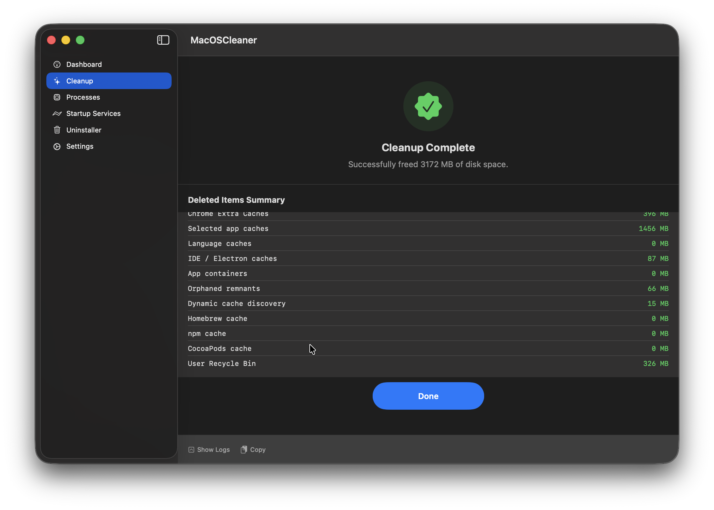

<p align="center">
  
</p>

<h1 align="center">macOS Cleaner</h1>

[](LICENSE)
[](https://apple.com)
[](https://swift.org)
[](https://developer.apple.com/xcode/swiftui/)
[](https://github.com/yonaskolb/XcodeGen)
[]()

🧹 Free up disk space by cleaning caches, temp files, app leftovers, and more. Everything goes to Trash — nothing is gone forever unless you say so.

---

## Screenshots

<p align="center">
  
  
</p>
<p align="center">
  
  
</p>

<p align="center">
  <a href="https://github.com/AlexTkDev/MacOSCleaner/tree/realese/assets/screenshots">📷 View all screenshots</a>
</p>

---

## Features

**Dashboard** 📊 — disk usage chart, system info (model, CPU, RAM, macOS version), cleanup history and stats.

**Smart Cleanup** 🔍 — scans 35 categories at once:

- **App Caches** — Google, Spotify, JetBrains, opencode, browsers (Safari, Chrome, Firefox, Edge, Brave, Vivaldi, Arc), messengers (Telegram, Discord, Slack, Signal, WeChat, Teams)
- **Package Managers** — Homebrew, npm, yarn, pnpm, CocoaPods
- **Dev Tools** — Xcode DerivedData, iOS Simulators (old runtimes too), Android SDK + Studio caches, Gradle/Maven, Flutter/Dart, language caches (Go, Rust, Python, Node.js, Ruby, Java, Julia, Elixir, Haskell, Swift PM, R)
- **IDE Caches** — Cursor, VS Code (incl. Insiders), Windsurf, Zed, JetBrains, Nova, Sublime Text, Atom, Eclipse, opencode, Claude, ChatGPT, Gemini, Perplexity, GitHub Desktop, Slack, Discord, Figma, Notion, Postman, Insomnia, Linear, Tower, TablePlus + dynamic Electron cache discovery
- **System Caches** — QuickLook, fonts, Spotlight, Siri, CloudKit, TimeMachine, icons
- **Docker** — container and image cleanup
- **App Containers** — sandboxed caches in Containers + Group Containers
- **Dotfile Caches** — AI CLI tools (opencode, Claude, Gemini, Codex, Aider), dev tools (npm logs, Terraform, Helm, Bazel, ccache, vcpkg)
- **Scattered Junk** — .DS_Store, __MACOSX, stray logs, Windows metadata (Thumbs.db, desktop.ini), broken symlinks
- **Orphaned Files** — leftovers from uninstalled apps in HTTPStorages, WebKit, Cookies, /Users/Shared
- **Old IDE Versions** — cleans system caches for VS Code, Cursor, Windsurf, Zed, Sublime Text, Eclipse, Atom; detects and removes leftover JetBrains cache/log directories for no-longer-installed products; cleans old Android Studio version caches (keeps latest); removes stale CachedData subdirectories for VS Code, Cursor, Windsurf (keeps latest version)
- **Large Files** — old DMG/pkg/iso/zip installers, node_modules (recursive), iPhone backups, IPSW firmware
- **Dynamic Cache Discovery** — auto-discovers large reverse-DNS caches in ~/Library/Caches; Apple caches (com.apple.*) at ≥ 5 MB, others at ≥ 20 MB
- **Time Machine Snapshots** — local APFS snapshots (macOS recreates them automatically)
- **iOS Backups** — re-downloadable from iCloud
- **Mail Downloads** — cached email attachments
- **Saved Application State** — window/session state (recreated on app launch)
- **Crash Reports** — old crash logs and diagnostic files
- **AssetsV2 / iWork Templates** — Pages/Numbers/Keynote templates (~800 MB, re-downloaded on demand)
- **iCloud CloudKit Cache** — metadata cache (rebuilt automatically)
- **SwiftPM Cache** — build/download cache (rebuilt on next build)
- **Carthage Cache** — dependency cache and spec repos
- **Steam Cache** — app cache, shader cache, depot cache, logs
- **Teams Cache** — Electron caches (Cache, Code Cache, GPUCache, IndexedDB)
- **Adobe Caches** — application and media caches
- **Chrome Extra Caches** — disk cache, code cache, GPU cache, service workers

All categories are always scanned. Dev-related ones show a purple "DEV" badge. Risk badges (Safe / Moderate / Dangerous / Protected) appear after scan — you pick what to delete, then confirm.

**Cleanup Options** — one opt-in toggle before scan:
- **Clean .DS_Store files** — removes Finder metadata from directories (off by default)

**Process Manager** ⚙️ — lists running processes, lets you terminate or force-kill them. Critical system processes (kernel_task, launchd, WindowServer) are protected.

**Startup Services** 🚀 — shows all LaunchAgents from `~/Library/LaunchAgents`, their load status, and lets you enable/disable them.

**App Uninstaller** 🗑️ — finds installed apps, scans for residual files (Caches, Preferences, Application Support, Logs), shows total space to reclaim. Expert Mode for cherry-picking leftovers.

**Deep Forensics Engine** 🔬 — when an app is selected for deep scan, the engine:
- **Identifies** the app via bundle ID, code signing (Team ID, signing authority), receipt presence, and sandbox status
- **Probes** every candidate file against 30 evidence types across 7 categories: identity, signature, system integration, metadata, content, graph relationships, and Launch Services registration
- **Builds an evidence graph** — links related files by parent–child relationships for propagation scoring
- **Confidence tiers** — each file receives a tier: `.guaranteed` (≥100 score with critical evidence), `.veryLikely` (≥60), `.possible` (≥30), or `.ignore` (<30)
- **Special rules** — JetBrains apps require ≥3 non-vendor evidence types; Electron, Flutter, Docker apps get targeted path probing
- **Developer artifacts** — detects Android SDK, Gradle/Maven, Xcode DerivedData, iOS Simulators, Flutter pub-cache, Docker containers, and Homebrew for deep uninstall

**Why this file?** — each related file includes an evidence breakdown with localized explanations. Tap any file in the detail view to see exactly why it was associated with the app: bundle ID match, parent directory, team ID, Launch Agent reference, etc. Every evidence type has a user-readable title and description in English, Russian, and Ukrainian.

**Settings** — light/dark/system theme, languages (English, Русский, Українська), notifications, scan-on-startup, Trash behavior, and more.

---

## How It Works

Runs on Apple Silicon (M1–M5) with full parallelism — cleanup categories execute concurrently across all available cores. File scanning is done with a stack-based iterator that batches work and deduplicates inodes. Size calculations are cached to avoid redundant work.

---

## Safety 🛡️

- Everything goes to Trash via `trashItem(at:)` — always recoverable
- `SafetyManager` blocks access to `/System`, `/usr`, `/bin`, `~/.ssh`, and other critical paths
- `ProcessSafetyPolicy` protects system-critical processes from termination
- Permanent deletion is opt-in and clearly marked in the UI
- Apps are closed before cleanup (graceful terminate → force-kill after 3s)
- Full Disk Access is requested at startup

---

## Tech Stack

- **Swift 6** — actors, `async/await`, structured task groups
- **SwiftUI** — `@Observable`, `NavigationSplitView`, Charts
- **Build** — XcodeGen, whole-module optimization, `-O` Swift flag
- **Logging** — OSLog with structured subsystems
- **Architecture** — feature-oriented folders, component-based cleanup

---

## Project Structure

```
MacOSCleaner/
├ App/              # Entry point, RootView, sidebar navigation
├ Domains/
│  ├ Cleanup/       # Coordinator, Engine, StateMachine, ItemManager, Notifier, Models
│  ├ ProcessManagement/  # ProcessManager, ProcessSafetyPolicy
│  └ StartupServices/    # LaunchServiceManager
├ Features/         # SwiftUI views + ViewModels (Dashboard, Cleanup, Processes, Settings, Uninstaller, About)
├ Infrastructure/   # CommandRunner, SafetyManager, TrashManager, LanguageManager, PosixScanner, actors
├ Models/           # CleanupItem, OperationRisk, RunningProcess, StartupService, etc.
└ Resources/        # Localizable.strings (en/ru/uk), assets
```

---

## Quick Start

**Requirements:** macOS 15.5+, Xcode 16+, [XcodeGen](https://github.com/yonaskolb/XcodeGen)

```bash
cd MacOSCleaner
xcodegen
open MacOSCleaner.xcodeproj
# Cmd+R to run, Cmd+U to run tests
```

---

## Building a Distributable .app

### Option 1: Xcode (Recommended)

```bash
cd MacOSCleaner
xcodegen
open MacOSCleaner.xcodeproj
```

In Xcode: **Product → Archive** → **Distribute App** → **Copy App** → choose destination.

### Option 2: Command Line

```bash
cd MacOSCleaner
xcodegen

xcodebuild -project MacOSCleaner.xcodeproj \
  -scheme MacOSCleaner \
  -configuration Release \
  -derivedDataPath build \
  -archivePath build/MacOSCleaner.xcarchive \
  archive

xcodebuild -exportArchive \
  -archivePath build/MacOSCleaner.xcarchive \
  -exportPath build/Export \
  -exportOptionsPlist ExportOptions.plist
```

Create `ExportOptions.plist`:

```xml
<?xml version="1.0" encoding="UTF-8"?>
<!DOCTYPE plist PUBLIC "-//Apple//DTD PLIST 1.0//EN" "http://www.apple.com/DTDs/PropertyList-1.0.dtd">
<plist version="1.0">
<dict>
    <key>method</key>
    <string>mac-application</string>
    <key>destination</key>
    <string>export</string>
    <key>signingStyle</key>
    <string>automatic</string>
</dict>
</plist>
```

### Option 3: Debug Build

```bash
cd MacOSCleaner
xcodebuild -project MacOSCleaner.xcodeproj \
  -scheme MacOSCleaner \
  -configuration Debug \
  -derivedDataPath build
```

---

## Code Signing

**Ad-hoc** (local testing only):
```bash
codesign --force --deep --sign - "/path/to/MacOSCleaner.app"
```
Gatekeeper will block this on other Macs unless they right-click → Open.

**Developer ID** (recommended for sharing):
```bash
codesign --force --deep --options runtime \
  --sign "Developer ID Application: Your Name (TEAM_ID)" \
  "/path/to/MacOSCleaner.app"

xcrun notarytool submit "/path/to/MacOSCleaner.app" \
  --apple-id "your@email.com" \
  --team-id "TEAM_ID" \
  --password "app-specific-password" \
  --wait

xcrun stapler staple "/path/to/MacOSCleaner.app"
```

**Verify:**
```bash
codesign --verify --deep --strict --verbose=2 "/path/to/MacOSCleaner.app"
spctl --assess --type execute --verbose "/path/to/MacOSCleaner.app"
```

**Fix damaged app attributes:**
```bash
sudo xattr -r -c /path/to/MacOSCleaner.app
```

---

**Logs:** open `Console.app` → filter by subsystem `com.alextkdev.macos-cleaner`.

---

## Feedback

Found a bug or have an idea? [Open an issue](https://github.com/AlexTkDev/MacOSCleaner/issues) — contributions are welcome.

---

## License

Custom Non-Commercial License — free to use, study, and fork for personal or educational purposes. Commercial use and redistribution are not permitted. See [LICENSE](LICENSE) for details.
