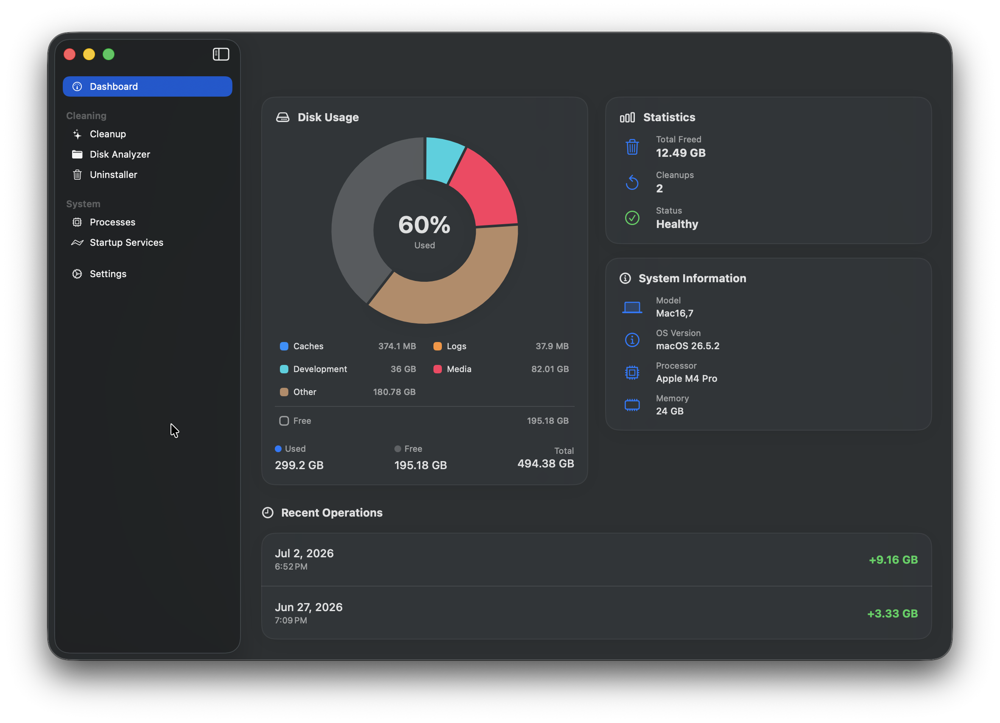
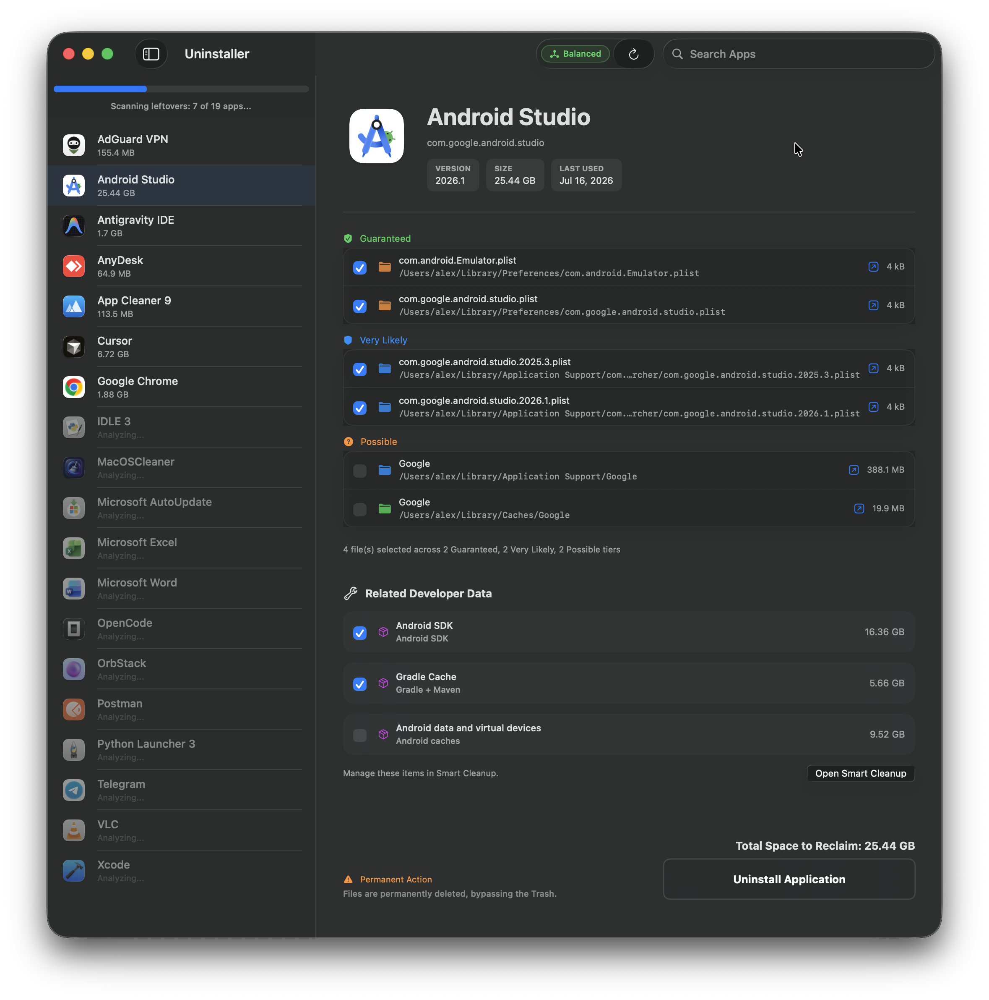
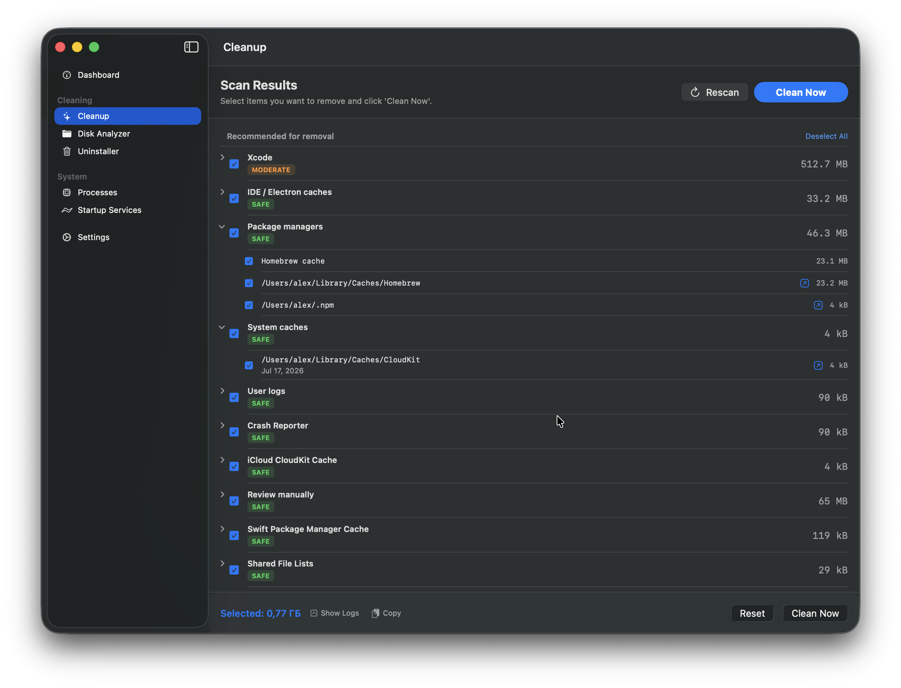
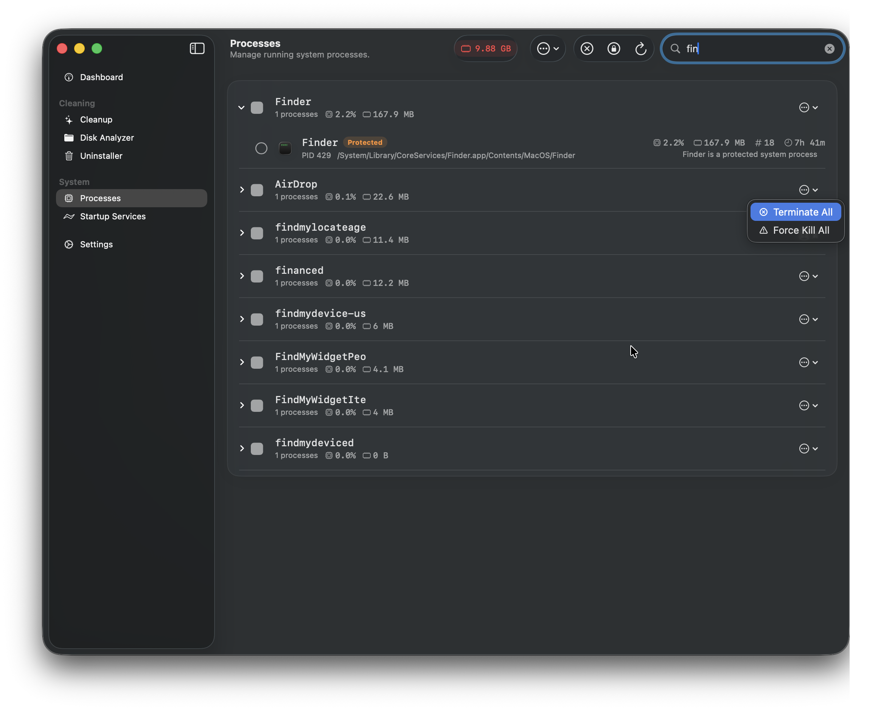

<h1 align="center">
   <span style="font-size:2em; font-weight:bold">MacOS Cleaner</span>
</h1>

<span align="center">

[](LICENSE)
[](https://apple.com)
[](https://swift.org)
[](https://developer.apple.com/documentation/swiftui/)
[](https://github.com/yonaskolb/XcodeGen)
[]()
[](https://ko-fi.com/alextkdev)

</span>

🧹 Free up disk space by cleaning caches, temp files, app leftovers, and more. Review candidates first, confirm what to remove, and recover from Trash when you need to.

---

## Screenshots

<p align="center">
  
  
</p>
<p align="center">
  
  
</p>

<p align="center">
  <a href="assets/screenshots">📷 View all screenshots</a>
</p>

---

## 🚀 Quick Install & Download

### GitHub Releases (DMG)
Download the latest signed release directly from **[GitHub Releases](https://github.com/AlexTkDev/MacOSCleaner/releases/latest)**.

---

## Features

🧠 **Apple Intelligence** — Native local AI explanations powered by `FoundationModels` (requires macOS 26.0+). Operates fully offline on supported Apple Silicon Macs. Explains files, caches, running processes, and startup agents to help you decide what is safe to remove. Prompts are optimized in English for higher model reasoning, with explanations output in your preferred UI language (English, Русский, Українська, Español). Fully toggleable in settings, with real-time model status tracking.

🌍 **Fully Localized** — English, Русский, Українська, Español. All UI, errors, logs, and system info translated dynamically. Dates and byte counts format automatically for your language.

**Dashboard** 📊 — redesigned with native macOS aesthetics: `controlBackgroundColor`, rounded cards, and SF Symbols. Disk usage chart, system info (model, CPU, RAM, macOS version), cleanup history and stats.

**Smart Cleanup** 🔍 — scans 54 categories with 450+ built-in cleaning paths:

- **Caches & Containers** — Browsers (Safari, Chrome, Firefox, Arc, etc.), Messengers, App Containers, System & WebKit caches, dynamic Electron discovery.
- **Dev Tools & IDEs** — Xcode DerivedData, Simulators, Android SDK/Studio, Package Managers (Homebrew, npm, Cargo, Go, SwiftPM), JetBrains, VS Code, Cursor, Docker.
- **System & Maintenance** — Time Machine snapshots, Mail attachments, Logs, Crash Reports, QuickLook thumbnails, Font & DNS cache flushing, LaunchAgents/Daemons.
- **Leftovers & Junk** — Uninstalled app remnants (HTTPStorages, Containers, Cookies), `.DS_Store`, `__MACOSX`, broken symlinks, old installers (DMG/pkg), duplicates, unused apps (180+ days).

Cleanup tasks run in parallel across all available cores for maximum speed. All categories are always scanned. Dev-related ones show a purple "DEV" badge. Risk badges (Safe / Moderate / Dangerous / Protected) appear after scan — you pick what to delete, then confirm.

**Cleanup Options** — toggles before scan:
- **Clean .DS_Store files** — removes Finder metadata from directories (off by default)
- **Clean Maven repository** — removes Maven cached dependencies from `~/.m2/repository` (off by default)
- **Clean Go module cache** — removes Go package caches from `GOMODCACHE` (off by default)
- **Clean .dart_tool in projects** — scans and cleans Flutter/Dart development builds in common project locations (off by default)
- **Clean iCloud Documents** — includes iCloud document cache (off by default)
- **Clean Voice Memos** — includes Voice Memos recordings (off by default)
- **Clean GarageBand / Logic** — includes project files and caches (off by default)
- **Clean iMovie / Final Cut** — includes render files and libraries (off by default)
- **Clean Sleep Image** — removes hibernation image file (off by default)

**Disk Space Analyzer** 📁 — scan any custom folder to browse its subdirectories and files sorted by size. Features categorized breakdowns (Videos, Audio, Photos, Apps, Documents, Archives) and lets you reveal items in Finder or move them to the Trash directly from the app.

**Process Manager** ⚙️ — redesigned with modern macOS styling. Lists running processes in Flat or Grouped views. Sorts by CPU, memory, name, or threads. Supports terminating/force-killing individual processes, multiple selection, or entire groups. Critical system processes (kernel_task, launchd, WindowServer) are protected automatically. Custom user Whitelists and Blacklists let you prevent accidental termination of specific apps or quickly close blacklisted ones.

**Startup Services** 🚀 — redesigned with modern macOS styling. Scans LaunchAgents and LaunchDaemons from both user-level (`~/Library`) and system-level (`/Library`) directories. Categorizes them automatically into My Services (User), Third-party, and System services. Allows you to load/unload or stop active services (asking for permissions via AppleScript when necessary), and configure custom vendor prefixes (System Vendors) to protect specific services from accidental modification.

**App Uninstaller** 🗑️ — drag and drop any `.app` bundle directly or select from the list. Finds installed apps, scans up to 5 levels deep for residual files using 30 types of evidence (Bundle ID, Team ID, Spotlight, Plist contents, known catalog paths, and more). Shows total reclaimable space and real-time scan progress. Tailored rules for popular apps including Docker, Parallels, Adobe CC, MS Office, Discord, Figma, JetBrains, browsers, and more.

- **Scan Modes (Safe / Balanced)** — choose between *Safe* mode (depth 3, exact matches only, no Spotlight, highest confidence files) and *Balanced* mode (depth 5, full deep scan including Spotlight and fuzzy matching) to tailor uninstallation aggressiveness
- **Background Deep Scanning** — apps are scanned thoroughly in the background; the UI updates in real time as each app's total size is finalized
- **Evidence-Based Forensics** — each candidate file is scored against 30 evidence types: identity, code signing, system integration, metadata, content analysis, graph relationships, and Launch Services registration
- **Confidence Tiers** — `.guaranteed` (critical evidence), `.veryLikely`, `.possible`, or `.ignore`
- **Developer Components** — detects and offers to clean Android SDK, Gradle/Maven, Xcode DerivedData, iOS Simulators, Flutter pub-cache, Docker containers, and Homebrew artifacts
- **Reveal in Finder** — quick action to show any related file or folder in Finder before deleting
- **Why this file?** — each related file includes an evidence breakdown with localized explanations. Tap any file to see exactly why it was associated with the app
- **Post-Uninstall Verification** — re-scan confirms cleanup completeness; snapshots stored for rollback

**Smart Updates** 🔄 — automatic, lightweight background check for new versions on startup directly via GitHub Releases. Get gently notified when a new update is ready, without background daemons, persistent tracking, or extra dependencies.

**Settings** — rebuilt with native macOS `Form` styles to match System Settings. Light/dark/system theme, languages (English, Русский, Українська, Español), notifications, scan-on-startup, Trash behavior (Empty Trash During Cleanup, Bypass Trash on Uninstall, Empty Trash Immediately), Apple Intelligence toggle, custom System Vendors, and more.

---

## How It Works

Runs on Apple Silicon (M1–M5) with full parallelism — cleanup categories execute concurrently across all available cores. File scanning is done with a stack-based iterator that batches work and deduplicates inodes. Size calculations are cached to avoid redundant work. Cleanup paths are embedded as static Swift arrays (`EmbeddedCleanupPaths` + `GeneratedCleanupPaths`) — no runtime JSON parsing.

---

## Privacy & Safety 🛡️

- **100% Private** — No telemetry, no analytics, no usage tracking, and no remote logging. All operations run fully offline on your device.
- **Minimal Networking** — The only network connection is a startup update check using the GitHub Releases API (can be disabled in Settings).
- Disk Space and App Uninstaller move files to Trash via `trashItem(at:)` — recoverable by default
- Smart Cleanup removes selected cache and temporary data after confirmation
- `SafetyManager` blocks access to `/System`, `/usr`, `/bin`, `~/.ssh`, and other critical paths
- `ProcessSafetyPolicy` protects system-critical processes from termination
- Permanent deletion and automatic Trash emptying are opt-in and clearly marked in the UI
- Apps are closed before cleanup (graceful terminate → force-kill after 3s)
- Full Disk Access is requested at startup

---

## Tech Stack

- **Swift 6** — actors, `async/await`, structured task groups
- **SwiftUI** — `@Observable`, `NavigationSplitView`, Charts
- **Build** — XcodeGen, whole-module optimization, `-O` Swift flag
- **Logging** — OSLog with structured subsystems
- **Architecture** — feature-oriented folders, component-based cleanup

---

## Build from Source

**Requirements:** macOS 26.0+, Xcode 18+, [XcodeGen](https://github.com/yonaskolb/XcodeGen)

```bash
cd MacOSCleaner
xcodegen
open MacOSCleaner.xcodeproj
```

Use **⌘R** to run, **⌘U** to test, or **Product → Archive** to create a distributable app.

---

## Troubleshooting

**⚠️ Fix damaged app attributes** (if macOS asks you to move app to trash):
```bash
sudo xattr -r -c /Applications/MacOSCleaner.app
```

---

**Logs:** open `Console.app` → filter by subsystem `input.MacOSCleaner`.

---

## Feedback

Found a bug or have an idea? [Open an issue](https://github.com/AlexTkDev/MacOSCleaner/issues) — contributions are welcome.

---

## License

Dual-licensed under:
- **[GNU General Public License v3.0 (GPLv3)](LICENSE)** for open-source use, personal study, and distribution.
- **Commercial License** for proprietary, enterprise, or closed-source integration. [Contact the author](https://github.com/AlexTkDev) for commercial licensing inquiries.

